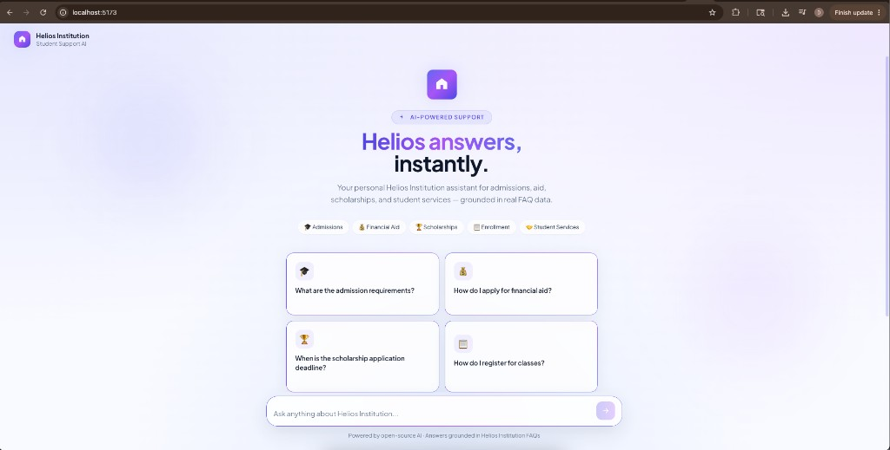
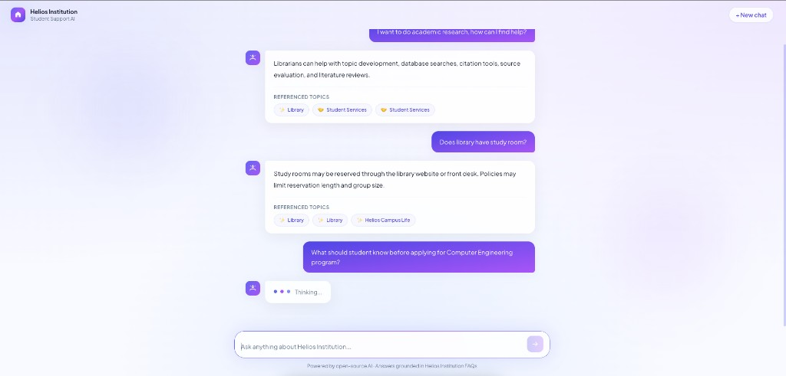
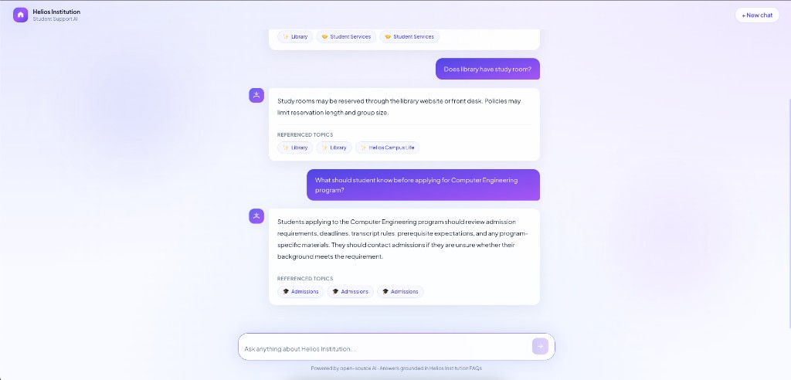

<h1 align="center">Helios Institution AI Assistant</h1>

<p align="center">
  AI-powered student support chatbot for <strong>Helios Institution</strong>, built for the MSAI-631 Human-Computer Interaction group project.
</p>

<p align="center">
  
</p>

<p align="center">
  
</p>

<p align="center">
  
</p>

The chatbot answers common student questions about admissions, academic programs, scholarships, financial aid, enrollment, and student services using retrieval-augmented generation (RAG) and a custom React interface.

## Technologies

| Technology | Purpose |
|---|---|
| Python 3.11 | Backend and AI pipeline |
| FastAPI | REST API for chat requests |
| React + Tailwind CSS | Custom aesthetic UI |
| Hugging Face Transformers | Open-source language model |
| sentence-transformers | Semantic embeddings for retrieval |
| FAISS | Vector similarity search |
| PyTorch | Model runtime |

## Project Structure

```
MSAI-631-final/
├── server.py              # FastAPI server + static frontend hosting
├── pyproject.toml         # Python dependencies (uv)
├── frontend/              # React UI
│   └── src/
├── data/faq.json          # Curated Helios Institution FAQ dataset
└── src/
    ├── service.py         # Shared chat service
    ├── retriever.py       # RAG retrieval
    └── chatbot.py         # Answer generation
```

## How It Works

1. The student asks a question in the React chat UI.
2. The frontend sends the message to `POST /api/chat`.
3. The question is embedded with `sentence-transformers`.
4. FAISS retrieves the most relevant FAQ entries.
5. Retrieved context is passed to an open-source Hugging Face model.
6. The UI displays the answer with cited sources.

## Setup and Run

### Production (one command after build)

```bash
cd frontend && npm install && npm run build && cd ..
uv run chatbot
```

Open **http://127.0.0.1:8000**

### Development (hot reload UI)

Terminal 1 — API:

```bash
uv run chatbot
```

Terminal 2 — React dev server:

```bash
cd frontend
npm install
npm run dev
```

Open **http://127.0.0.1:5173**

## Model Notes

- **Embeddings:** `sentence-transformers/all-MiniLM-L6-v2`
- **Generation:** `google/flan-t5-base` (lightweight, laptop-friendly)

## Team Roles

| Member | Role |
|---|---|
| Durga Ravichandra Malisetty | Project Lead / FAQ Curation |
| Aira Bhaima Shrestha | QA / Model Integration |
| Asif Ansari | Presentation Lead |
| Huy Lam Nguyen | Software Engineer |
| Joanna Trautman | Presentation Design |
| Manindra Reddy Bhavanam | Python Implementation |
| Sinza Shrestha | Documentation Lead |

## Course Compliance

- Open-source only (no OpenAI or paid APIs)
- Runs locally on a standard laptop
- Demonstrates HCI through a conversational interface
- Uses Hugging Face as required by the course

## Attribution and References

This project extends common open-source chatbot and RAG patterns. The FAQ dataset, FastAPI backend, RAG pipeline, and React UI were developed for this course project. The following technologies, libraries, models, and tools were used:

### AI and Machine Learning

| Resource | Citation |
|---|---|
| **Hugging Face Transformers** | Wolf, T., et al. (2020). *Transformers: State-of-the-Art Natural Language Processing.* [https://huggingface.co/docs/transformers](https://huggingface.co/docs/transformers) |
| **google/flan-t5-base** | Chung, H. W., et al. (2022). *Scaling Instruction-Finetuned Language Models.* [https://huggingface.co/google/flan-t5-base](https://huggingface.co/google/flan-t5-base) |
| **sentence-transformers** | Reimers, N., & Gurevych, I. (2019). *Sentence-BERT: Sentence Embeddings using Siamese BERT-Networks.* [https://www.sbert.net/](https://www.sbert.net/) |
| **all-MiniLM-L6-v2** | Reimers, N., & Gurevych, I. (2019). *all-MiniLM-L6-v2 model card.* [https://huggingface.co/sentence-transformers/all-MiniLM-L6-v2](https://huggingface.co/sentence-transformers/all-MiniLM-L6-v2) |
| **PyTorch** | Paszke, A., et al. (2019). *PyTorch: An Imperative Style, High-Performance Deep Learning Library.* [https://pytorch.org/](https://pytorch.org/) |
| **FAISS** | Johnson, J., Douze, M., & Jégou, H. (2019). *Billion-scale similarity search with GPUs.* [https://github.com/facebookresearch/faiss](https://github.com/facebookresearch/faiss) |
| **Hugging Face Accelerate** | Hugging Face. *Accelerate library documentation.* [https://huggingface.co/docs/accelerate](https://huggingface.co/docs/accelerate) |
| **NumPy** | Harris, C. R., et al. (2020). *Array programming with NumPy.* [https://numpy.org/](https://numpy.org/) |

### Backend and API

| Resource | Citation |
|---|---|
| **Python 3.11** | Python Software Foundation. *Python 3.11 documentation.* [https://docs.python.org/3.11/](https://docs.python.org/3.11/) |
| **FastAPI** | Ramírez, S. (2018–present). *FastAPI framework documentation.* [https://fastapi.tiangolo.com/](https://fastapi.tiangolo.com/) |
| **Uvicorn** | Encode. *Uvicorn ASGI server documentation.* [https://www.uvicorn.org/](https://www.uvicorn.org/) |
| **Starlette** | Encode. *Starlette web framework documentation.* [https://www.starlette.io/](https://www.starlette.io/) |
| **Gradio** | Abid, A., et al. (2023). *Gradio: Hassle-Free Sharing and Testing of ML Models in the Wild.* [https://www.gradio.app/](https://www.gradio.app/) |
| **uv** | Astral. *uv Python package and project manager.* [https://docs.astral.sh/uv/](https://docs.astral.sh/uv/) |

### Frontend

| Resource | Citation |
|---|---|
| **React** | Meta Open Source. *React documentation.* [https://react.dev/](https://react.dev/) |
| **Vite** | Vite Team. *Vite build tool documentation.* [https://vite.dev/](https://vite.dev/) |
| **TypeScript** | Microsoft. *TypeScript documentation.* [https://www.typescriptlang.org/](https://www.typescriptlang.org/) |
| **Tailwind CSS** | Tailwind Labs. *Tailwind CSS documentation.* [https://tailwindcss.com/](https://tailwindcss.com/) |
| **PostCSS** | PostCSS. *PostCSS documentation.* [https://postcss.org/](https://postcss.org/) |
| **Autoprefixer** | PostCSS. *Autoprefixer documentation.* [https://github.com/postcss/autoprefixer](https://github.com/postcss/autoprefixer) |

### Development Tools

| Resource | Citation |
|---|---|
| **Cursor** | Anysphere. *Cursor AI code editor.* Used for AI-assisted development, debugging, and documentation during this project. [https://cursor.com/](https://cursor.com/) |

### Reused Patterns and Tutorials

| Resource | Citation |
|---|---|
| **Course starting-point example** | Dennis, A. L. *MSAI-631 Group Project.* Suggested starting query: "huggingface chatbot gradio". |
| **Hugging Face + Gradio chatbot tutorial** | Banerjee, A. (2023). *Build an AI Chatbot in 5 Minutes With Hugging Face and Gradio.* KDnuggets. [https://www.kdnuggets.com/2023/06/build-ai-chatbot-5-minutes-hugging-face-gradio.html](https://www.kdnuggets.com/2023/06/build-ai-chatbot-5-minutes-hugging-face-gradio.html) |
| **RAG pattern** | Lewis, P., et al. (2020). *Retrieval-Augmented Generation for Knowledge-Intensive NLP Tasks.* [https://arxiv.org/abs/2005.11401](https://arxiv.org/abs/2005.11401) |

### Project Extensions

The original tutorial and common Hugging Face examples were extended in the following ways:

- Added a custom React + Tailwind chat interface instead of using Gradio as the primary UI
- Implemented a FastAPI backend with `/api/chat`, `/api/health`, and `/api/examples` endpoints
- Built a FAISS-based retrieval layer over a curated Helios Institution FAQ dataset
- Added source attribution in the UI through referenced FAQ topics
- Packaged the application for local execution with `uv run chatbot`
